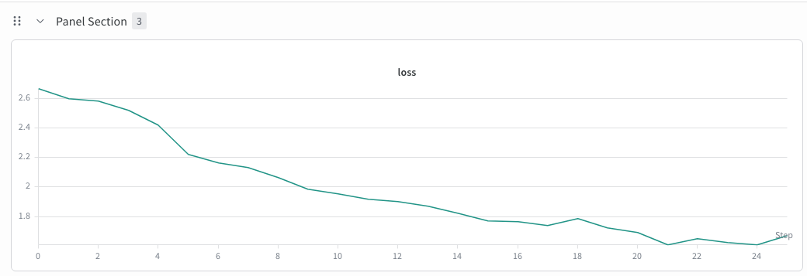

# Fine-Tune Nemotron-3-Ultra-550B

## Introduction

[nvidia/NVIDIA-Nemotron-3-Ultra-550B-A55B-BF16](https://huggingface.co/nvidia/NVIDIA-Nemotron-3-Ultra-550B-A55B-BF16) is a frontier-scale large language model (LLM) trained by NVIDIA, designed to deliver strong agentic, reasoning, and conversational capabilities. It is optimized for the most demanding workloads, including complex multi-step agents, long-context analysis, and high-accuracy reasoning over code, math, and science. Like other models in the family, it responds to user queries and tasks by first generating a reasoning trace and then concluding with a final response. The model's reasoning capabilities can be configured through a flag in the chat template.

The model employs a hybrid Latent Mixture-of-Experts (LatentMoE) architecture, utilizing interleaved Mamba-2 and MoE layers, along with select Attention layers. Like the Super model, the Ultra model incorporates Multi-Token Prediction (MTP) layers for faster text generation and improved quality, and it is trained using an NVFP4 pre-training recipe to maximize compute efficiency. The model has 55B active parameters and 550B parameters in total.

This guide walks you through fine-tuning Nemotron-3-Ultra on HellaSwag using NVIDIA NeMo Automodel. You will learn how to configure the recipe, launch training, and inspect the results.

To set up your environment to run NeMo Automodel, follow the [installation guide](https://github.com/NVIDIA-NeMo/Automodel#-install-nemo-automodel).

## Data

### HellaSwag

We use [HellaSwag](https://huggingface.co/datasets/Rowan/hellaswag), a commonsense natural-language-inference dataset consisting of context + four candidate continuations. The version used here is the standard `rowan/hellaswag` HuggingFace split, formatted for next-token-prediction fine-tuning.

- **Train / validation splits** taken directly from the HuggingFace dataset.
- **Tokenizer**: shared with the base model (instantiated from the Nemotron-3-Ultra checkpoint's config).
- **Sequence packing**: THD packing with `packed_sequence_size=2048` (`packing_strategy: thd`) via the packed-sequence THD collater. Validation uses the same THD collater, so the whole run stays on the packed `(1, T)` path used by the Transformer Engine attention backend.

For the full HellaSwag dataset wrapper used in NeMo Automodel, see [`nemo_automodel.components.datasets.llm.hellaswag.HellaSwag`](https://github.com/NVIDIA-NeMo/Automodel/blob/main/nemo_automodel/components/datasets/llm/hellaswag.py).

## Launch Training

A ready-to-use PEFT (LoRA) recipe ships at [`examples/llm_finetune/nemotron/nemotron_ultra_v3_hellaswag_peft_gb200.yaml`](https://github.com/NVIDIA-NeMo/Automodel/blob/main/examples/llm_finetune/nemotron/nemotron_ultra_v3_hellaswag_peft_gb200.yaml), validated on 4 × GB200 (16 GPUs). An H100-oriented variant — same recipe, `deepep` dispatcher and `ep_size: 32` for a 4 × 8 H100 allocation — ships at [`examples/llm_finetune/nemotron/nemotron_ultra_v3_hellaswag_peft.yaml`](https://github.com/NVIDIA-NeMo/Automodel/blob/main/examples/llm_finetune/nemotron/nemotron_ultra_v3_hellaswag_peft.yaml).

NeMo Automodel supports several ways to launch training — via the Automodel CLI with Slurm, interactive sessions, `torchrun`, and more. For full details on all launch options (Slurm batch jobs, multi-node configuration, environment variables, etc.), see the [Run on a Cluster](https://github.com/NVIDIA-NeMo/Automodel/blob/main/docs/launcher/slurm.md) guide.

### Standalone Slurm Script

This recipe runs in the **26.04 NeMo Automodel container** — `nvcr.io/nvidia/nemo-automodel:26.04.00` — and expects **your `main` checkout of Automodel mounted over the container's `/opt/Automodel`**, so the run uses the latest code rather than the image's baked-in copy. Clone it once onto a shared filesystem that every node can see:

```bash
git clone https://github.com/NVIDIA-NeMo/Automodel.git
cd Automodel && git checkout main && git pull
```

The Slurm script below is the one used to fine-tune Nemotron-3-Ultra on 4 × GB200 (16 GPUs). It drives `torchrun` from inside an `srun` step that rendezvouses on the first allocated node and forwards the per-node rank. Fill in the `<...>` placeholders (account, credentials, paths), point the `/opt/Automodel` mount at the clone above, then `sbatch` it:

```bash
#!/bin/bash
#SBATCH --job-name=nemotron_ultra_peft
#SBATCH --account=<your_account>
#SBATCH --partition=<your_partition>
#SBATCH --qos=<your_QOS>
#SBATCH --nodes=4
#SBATCH --gpus-per-node=4          # GB200: 4 GPUs/node -> 16 GPUs total (matches ep_size: 16)
#SBATCH --segment=4                # GB200 NVL: place the 4 nodes in one NVLink domain
#SBATCH --time=04:00:00
#SBATCH --output=ultra_peft_%j.log

set -uo pipefail

# --- Credentials ---
export HF_TOKEN=<your-hf-token>
export HF_HOME=/your/shared/hf_cache
export WANDB_API_KEY=<your-wandb-key>

export CONT=nvcr.io/nvidia/nemo-automodel:26.04.00
export CONT_NAME=nemo-automodel-2604

# --- Mounts: overlay YOUR `main` checkout on /opt/Automodel, plus the shared FS ---
export CONT_MOUNT="\
/your/clone/of/Automodel:/opt/Automodel,\
/your/shared/hf_cache:/your/shared/hf_cache"

GPUS_PER_NODE=4
CONFIG=/opt/Automodel/examples/llm_finetune/nemotron/nemotron_ultra_v3_hellaswag_peft_gb200.yaml

HEAD=$(scontrol show hostnames "$SLURM_JOB_NODELIST" | head -n1)
echo "==> job $SLURM_JOB_ID on $SLURM_JOB_NODELIST | head=$HEAD | config=$CONFIG"

srun \
    --container-image="$CONT" \
    --container-name="$CONT_NAME" \
    --container-mounts="$CONT_MOUNT" \
    --no-container-mount-home \
    --export=ALL,HF_TOKEN="$HF_TOKEN",HF_HOME="$HF_HOME",WANDB_API_KEY="$WANDB_API_KEY" \
    -N "$SLURM_NNODES" --ntasks-per-node=1 \
    bash -c 'cd /opt/Automodel && torchrun \
        --nnodes='"$SLURM_NNODES"' --nproc-per-node='"$GPUS_PER_NODE"' --node-rank=$SLURM_NODEID \
        --rdzv-id=$SLURM_JOB_ID --rdzv-backend=c10d \
        --rdzv-endpoint='"$HEAD"':29500 \
        /opt/Automodel/examples/llm_finetune/finetune.py \
        --config '"$CONFIG"
```

**Before you start**:
- **Container**: use `nvcr.io/nvidia/nemo-automodel:26.04.00`. Pyxis pulls it from NGC on first use; on a multi-node run you can pre-import it to a local `.sqsh` (`enroot import`) to avoid every node pulling it.
- **Mount `main`**: the `/your/clone/of/Automodel:/opt/Automodel` bind mount is what makes the job run your checked-out `main` instead of the image's frozen copy — keep it pointed at the clone from the step above.
- **GPU count**: set `--gpus-per-node` / `--nproc-per-node` to the GPUs per node (`4` on GB200) and size `distributed.ep_size` to the total GPU count (16 here).
- **First-run download**: the recipe pulls the ~1 TB model from the Hugging Face Hub into `HF_HOME`. Because rank 0 downloads while the other ranks wait at a collective, the recipe ships with `dist_env.timeout_minutes: 120` — keep it generous, or pre-stage the model into `HF_HOME` (HF applies download rate limits, so cloning ahead of time is recommended).
- **Caches**: ensure `HF_HOME` is on a shared filesystem.
- **W&B**: set `WANDB_API_KEY` and configure the `wandb` section in the YAML, or drop the `WANDB_API_KEY` export to skip it.

## Training Results

The recipe was validated with LoRA PEFT on HellaSwag on a 4 × GB200 (16-GPU) allocation, using the hybrid Mamba-2 / MoE Ultra backbone with MTP and Transformer Engine kernels. Training loss decreased steadily over the run (≈2.67 → ≈1.6), confirming healthy convergence end-to-end through model load, THD-packed data, FSDP2 + expert parallelism, and safetensors checkpointing.

<p align="center">
  
</p>
